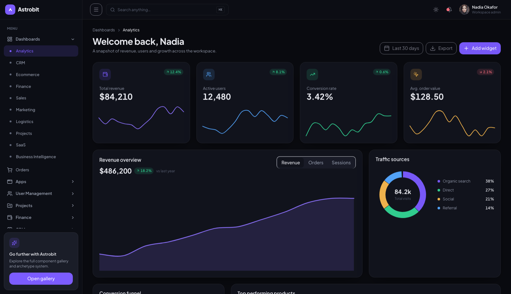
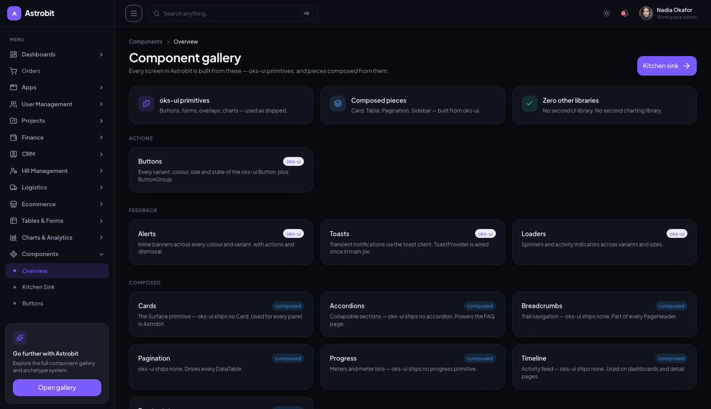
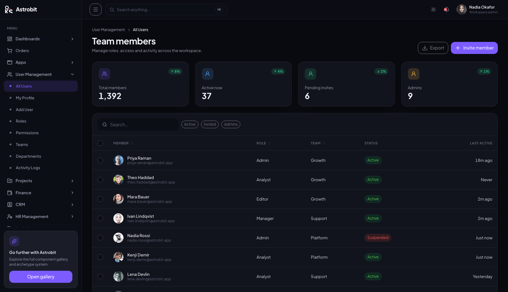

# Astrobit

An admin dashboard template built **entirely with [oks-ui](https://www.npmjs.com/package/oks-ui)** —
every button, input, chart, table, nav tree, board and command palette is an
oks-ui component, used as shipped. The only thing assembled by hand is the app
shell (sidebar + header + content frame). No second UI library, no second
charting library.

**Live demo:** <https://oks-projects.github.io/astrobit/> · **Repository:** <https://github.com/OKS-PROJECTS/astrobit>

[](https://oks-projects.github.io/astrobit/)

- **Stack:** Vite + React 19 · react-router-dom v7 · Tailwind v4 (layout only) ·
  lucide-react · oks-ui
- **Theme:** dark-first, light included, one `src/styles/theme.css`
- **Data:** deterministic mock data in `src/data/` — there is no backend

## Scripts

```bash
npm install
npm run dev      # start the dev server
npm run build    # production build
npm run lint     # oxlint
npm run preview  # preview the production build
```

## How the `ui/` layer works

As of oks-ui 1.1, the library ships the whole application layer — `Card`,
`Table`, `Pagination`, `Nav`, `Breadcrumbs`, `Board`, `Timeline`, `EmptyState`,
`Skeleton`, `Progress`, `Accordion`, `SegmentedControl`, `CommandPalette` and
more. `src/Components/ui/` is now just a **thin adapter layer**: each file
(`Surface`, `DataTable`, `MeterList`, `BoardView`, …) renames props to Astrobit's
vocabulary and wires the `--app-*` tokens, then delegates to the real oks-ui
component. The one genuinely hand-built piece is the app shell.

Most screens are **config objects, not bespoke components**. A list, form,
detail view, settings panel, board or report is an entry in `src/data/*.jsx`
consumed by an archetype component in `src/Pages/InnerPages/`. Bespoke screens
(chat, email, calendar, file manager, gantt, heatmap, …) live under
`src/Pages/InnerPages/` too. Every route in the sidebar resolves to a real page.

## Theming

Edit `src/styles/theme.css`. Repoint the brand ramp and the `--app-*` layer;
light, dark and every component follow automatically.

See [CHANGELOG.md](./CHANGELOG.md) for release history and the compatible oks-ui
range.

## Screenshots

| Component gallery | Team members (list archetype) |
| --- | --- |
|  |  |

## License

[MIT](./LICENSE) © OKS-PROJECTS
